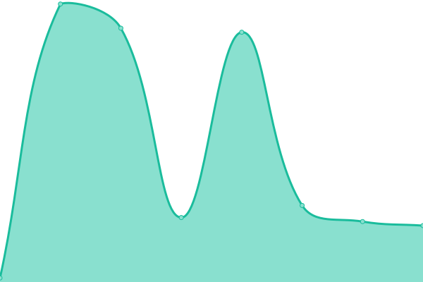

# [📈 Live Status](https://HyenaMC.github.io/upptime): <!--live status--> **🟧 Partial outage**

This repository contains the open-source uptime monitor and status page for [HyenaMC](account.teamhyena.org), powered by [Upptime](https://github.com/upptime/upptime).

With [Upptime](https://upptime.js.org), you can get your own unlimited and free uptime monitor and status page, powered entirely by a GitHub repository. We use [Issues](https://github.com/HyenaMC/upptime/issues) as incident reports, [Actions](https://github.com/HyenaMC/upptime/actions) as uptime monitors, and [Pages](https://HyenaMC.github.io/upptime) for the status page.

<!--start: status pages-->
<!-- This summary is generated by Upptime (https://github.com/upptime/upptime) -->
<!-- Do not edit this manually, your changes will be overwritten -->
<!-- prettier-ignore -->
| URL | Status | History | Response Time | Uptime |
| --- | ------ | ------- | ------------- | ------ |
|  [Skin Station](https://account.teamhyena.org) | 🟥 Down | [skin-station.yml](https://github.com/HyenaMC/upptime/commits/HEAD/history/skin-station.yml) | 

 6888ms
     
 | 

<a href="https://status.teamhyena.org/history/skin-station">99.97%</a>
    

|  [Official Website](https://minecraft.teamhyena.org) | 🟩 Up | [official-website.yml](https://github.com/HyenaMC/upptime/commits/HEAD/history/official-website.yml) | 

 3035ms
     
 | 

<a href="https://status.teamhyena.org/history/official-website">99.79%</a>
    

|  [Gateway (NA)](mc-na.teamhyena.org) | 🟥 Down | [gateway-na.yml](https://github.com/HyenaMC/upptime/commits/HEAD/history/gateway-na.yml) | 

 37ms
     
 | 

<a href="https://status.teamhyena.org/history/gateway-na">78.75%</a>
    

|  [Gateway (CS)](mc-cs.teamhyena.org) | 🟥 Down | [gateway-cs.yml](https://github.com/HyenaMC/upptime/commits/HEAD/history/gateway-cs.yml) | 

 245ms
     
 | 

<a href="https://status.teamhyena.org/history/gateway-cs">92.02%</a>
    

|  [Gateway (LA)](mc-la.teamhyena.org) | 🟩 Up | [gateway-la.yml](https://github.com/HyenaMC/upptime/commits/HEAD/history/gateway-la.yml) | 

 42ms
     
 | 

<a href="https://status.teamhyena.org/history/gateway-la">100.00%</a>
    

|  [Gateway (SF)](mc-sf.teamhyena.org) | 🟥 Down | [gateway-sf.yml](https://github.com/HyenaMC/upptime/commits/HEAD/history/gateway-sf.yml) | 

 0ms
     
 | 

<a href="https://status.teamhyena.org/history/gateway-sf">0.00%</a>
    

|  [Gateway (TS)](mc-ts.teamhyena.org) | 🟥 Down | [gateway-ts.yml](https://github.com/HyenaMC/upptime/commits/HEAD/history/gateway-ts.yml) | 

 19969ms
     
 | 

<a href="https://status.teamhyena.org/history/gateway-ts">0.00%</a>
    

|  [Gateway (NP)](mc-np.teamhyena.org) | 🟩 Up | [gateway-np.yml](https://github.com/HyenaMC/upptime/commits/HEAD/history/gateway-np.yml) | 

 522ms
     
 | 

<a href="https://status.teamhyena.org/history/gateway-np">100.00%</a>
    

<!--end: status pages-->

[**Visit our status website →**](https://HyenaMC.github.io/upptime)

## 📄 License

- Powered by: [Upptime](https://github.com/upptime/upptime)
- Code: [MIT](./LICENSE) © [Anand Chowdhary](https://anandchowdhary.com), supported by [Pabio](https://pabio.com)
- Data in the `./history` directory: [Open Database License](https://opendatacommons.org/licenses/odbl/1-0/)
